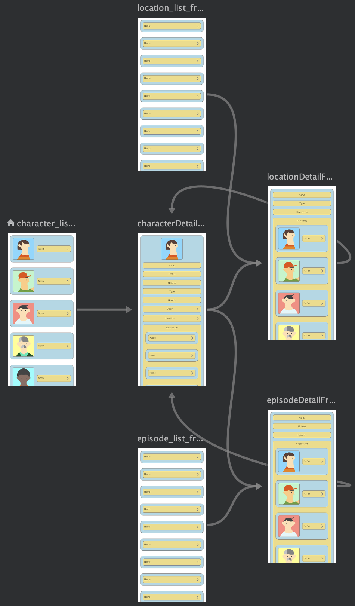
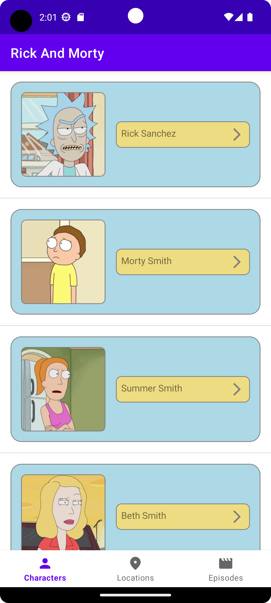
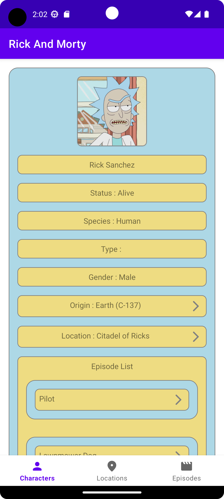
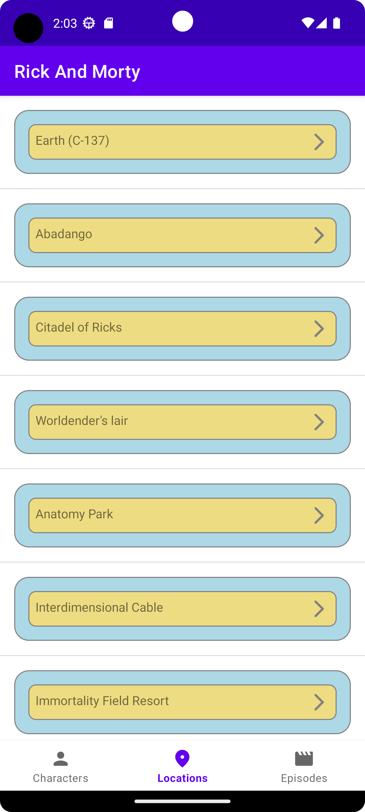
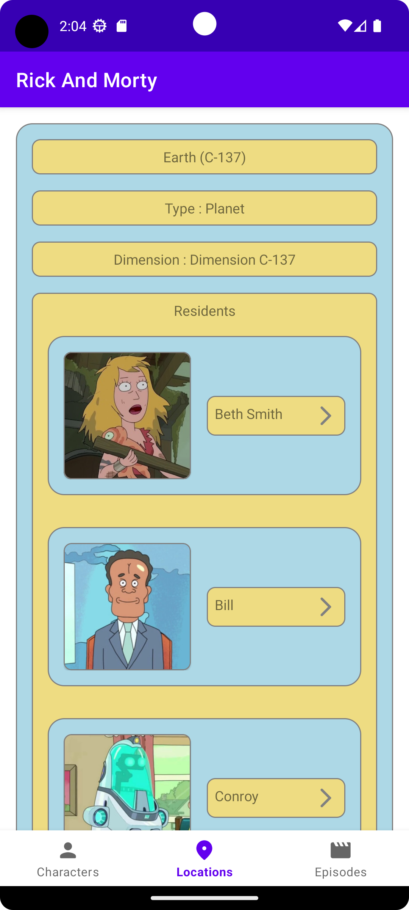
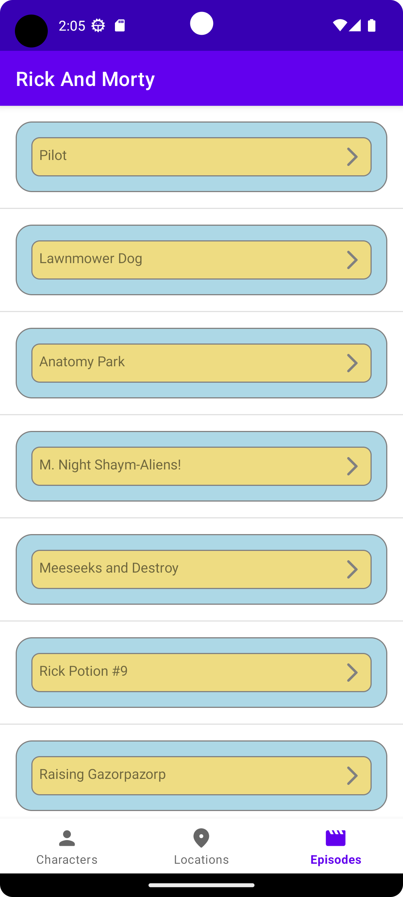
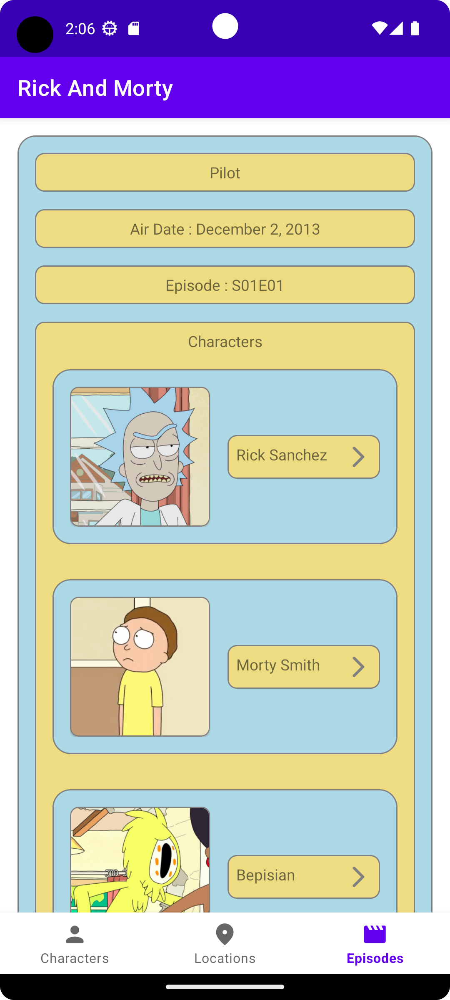

# Rick-And-Morty
Rick And Morty Android

## Used Technologies

- [MVVM Architecture](https://developer.android.com/topic/libraries/architecture/viewmodel)
- [Navigation](https://developer.android.com/guide/navigation/navigation-getting-started)
- [Retrofit](https://square.github.io/retrofit/)
- [Dagger Hilt](https://dagger.dev/hilt/)
- [Paging](https://developer.android.com/topic/libraries/architecture/paging/v3-overview)
- [Coroutines](https://developer.android.com/kotlin/coroutines)
- [StateFlow](https://developer.android.com/kotlin/flow/stateflow-and-sharedflow)
- [Glide](https://bumptech.github.io/glide/)
- [View binding](https://developer.android.com/topic/libraries/view-binding)

### Special Thanks
[Rick And Morty Api](https://rickandmortyapi.com/)

|Nav Graph|
|-|
||

|Character List|Character Detail|
|-|-|
|||

|Location List|Location Detail|
|-|-|
|||

|Episode List|Episode Detail|
|-|-|
|||
